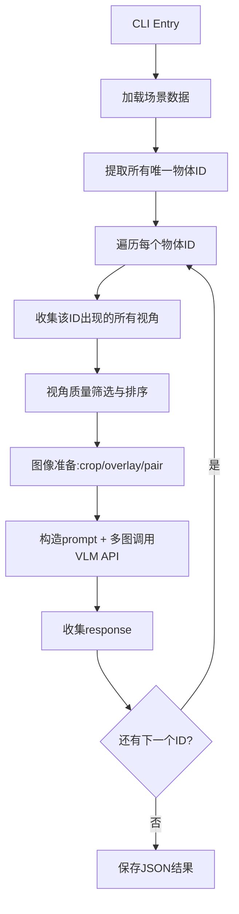

# VLM Scene Object Processing Pipeline

## 数据现状

- 数据根目录：`/home/liaowanjun/Datas/instascene_preprocessed_data/`
- 结构：`{dataset}/{scene}/images/*.jpg` + `{dataset}/{scene}/sam/mask/*.png`
- Mask 格式：8-bit PNG，像素值即实例 ID（0=背景，1-255=实例），跨视角一致
- 3 个数据集（3dovs/lerf/zipnerf），7 个已解压场景

## 整体架构




## 模块设计

在数据根目录下创建 `scripts/` 目录，包含以下文件：

### 1. `scripts/config.py` — 配置管理

- 使用 dataclass 定义所有可配置参数
- 关键配置项：
  - `data_root`: 数据根路径
  - `dataset`: 数据集名（3dovs/lerf/zipnerf）
  - `scene`: 场景名（bench/bed/...），支持 `all`
  - `mask_subdir`: 使用哪个 mask 目录（默认 `mask`，可选 `mask_filtered` 等）
  - `min_pixel_count`: 最小像素数阈值（过滤太小的物体视角）
  - `min_pixel_ratio`: 物体像素占 bbox 面积的最小比例
  - `min_bbox_area_ratio`: bbox 占全图面积的最小比例
  - `max_views`: 每个物体最多选取的视角数（考虑 API token/图片数限制）
  - `image_mode`: 图像输入模式（`crop_only` / `overlay_only` / `pair` / `per_view`）
  - `overlay_style`: overlay 风格（`contour` / `bbox` / `semitransparent` / `all`）
  - `api_base_url`: OpenAI 兼容 API 地址
  - `api_key`: API Key（优先从环境变量 `VLM_API_KEY` 读取）
  - `model_name`: 模型名称（如 `gpt-5`、`qwen3-vl`）
  - `prompt_template`: prompt 模板字符串，支持占位符
  - `max_concurrent`: 并发请求数
  - `output_dir`: 输出目录（默认场景目录下 `vlm_results/`）

### 2. `scripts/data_loader.py` — 数据加载

- `load_scene(data_root, dataset, scene, mask_subdir)` -> `SceneData`
  - 读取所有图像路径，加载所有 mask PNG 为 numpy array
  - 提取全局唯一 ID 列表（遍历所有 mask，取 `np.unique`，去掉 0）
  - 构建映射：`{obj_id: [(view_name, mask_array, image_path), ...]}`

### 3. `scripts/view_selector.py` — 视角筛选与排序

对每个 object ID，在所有出现该 ID 的视角中：

- **过滤条件**（可配置阈值）：
  - 像素计数：`np.sum(mask == obj_id)` >= `min_pixel_count`
  - bbox 面积比：物体 bbox 占全图面积 >= `min_bbox_area_ratio`
  - 像素密度：物体像素占 bbox 面积的比例（过滤遮挡严重/碎片化的视角）
- **排序策略**：按像素数量降序（大面积视角优先）
- **截取**：取 top-K 个视角（`max_views`）
- 返回 `List[ViewInfo]`，包含 view_name、bbox、pixel_count、quality_score 等

### 4. `scripts/image_preparer.py` — 图像准备

根据 `image_mode` 配置，为每个选中视角生成输入图像：

- `**crop_only`**：tight crop，用 mask 扣出物体区域，背景设白/透明，按 bbox 裁剪并适当 padding
- `**overlay_only`**：全图 + overlay 标注（bbox 框 / 轮廓线 / 半透明高亮，由 `overlay_style` 控制）
- `**pair`**：每个视角生成两张图 `[overlay_full_image, tight_crop]`，拼成 pair
- `**per_view`**：同 `pair`，但不合并多视角，逐视角单独处理

图像处理使用 OpenCV/PIL：

- crop 时加 padding（bbox 外扩 10-20%），避免物体紧贴边缘
- overlay 使用 `cv2.drawContours` 画轮廓、`cv2.rectangle` 画 bbox、alpha blend 做半透明
- 输出为 base64 编码（供 API 调用）或临时文件路径

### 5. `scripts/vlm_client.py` — VLM API 调用

- 封装 OpenAI 兼容的 multi-image chat completion 调用
- 使用 `openai` Python SDK（`AsyncOpenAI`），设置 `base_url`
- 构造 message 格式：

```python
messages = [
    {"role": "user", "content": [
        {"type": "text", "text": prompt},
        {"type": "image_url", "image_url": {"url": f"data:image/jpeg;base64,{b64_img1}"}},
        {"type": "image_url", "image_url": {"url": f"data:image/jpeg;base64,{b64_img2}"}},
        # ... more images
    ]}
]
```

- 支持重试（exponential backoff）、rate limiting
- 支持 asyncio 并发控制（`asyncio.Semaphore`）

### 6. `scripts/pipeline.py` — 主流程编排

```python
async def process_scene(config):
    scene_data = load_scene(...)
    results = []
    
    for obj_id in scene_data.object_ids:
        views = select_views(obj_id, scene_data, config)
        if not views:
            continue
        images = prepare_images(views, config)
        prompt = config.prompt_template.format(n_views=len(views), ...)
        response = await vlm_call(prompt, images, config)
        results.append({"id": int(obj_id), "response": response})
    
    save_json(results, output_path)
```

- 支持断点续传：已处理的 ID 跳过（检查输出 JSON 中已有的 ID）
- 进度条显示（tqdm）
- 错误处理：单个 ID 失败不影响整体，记录到 error log

### 7. `scripts/run.py` — CLI 入口

- 使用 `argparse` 解析命令行参数，覆盖 config 默认值
- 支持处理单个场景或批量处理所有场景

```bash
python scripts/run.py --dataset 3dovs --scene bench --model gpt-5 --image-mode pair
python scripts/run.py --dataset all --scene all  # 批量处理
```

## 输出格式

每个场景输出 `{dataset}/{scene}/vlm_results/{model_name}.json`：

```json
[
    {"id": 1, "response": "A wooden bench with ..."},
    {"id": 2, "response": "A red flower pot ..."},
    ...
]
```

## 依赖

`scripts/requirements.txt`：

- `openai` (async client)
- `numpy`
- `opencv-python`
- `Pillow`
- `tqdm`
- `argparse`（标准库）

## 关键设计决策

- **mask 子目录可配置**：3dovs 有多种 mask 变体，默认用 `mask`，可切换
- **图像模式可配置**：4 种模式（crop/overlay/pair/per_view），方便后续实验对比
- **VLM 无关设计**：通过 OpenAI 兼容 API 抽象，换模型只需改 `base_url` + `model_name`
- **prompt 模板化**：后续换任务只需改 prompt，pipeline 不变
- **异步并发**：用 asyncio + semaphore 控制并发数，提高吞吐
- **断点续传**：避免大规模处理中断后重头再来

